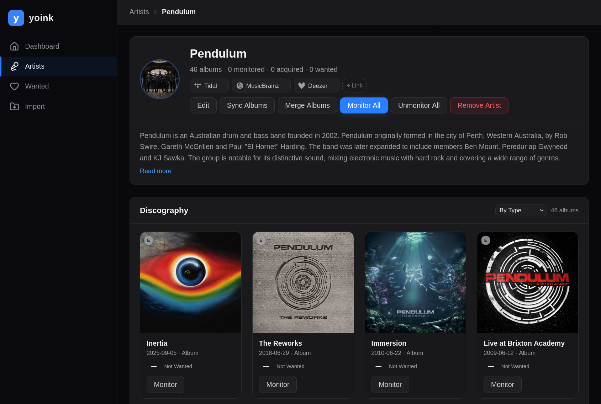

<h1 align="center">
  <br/>
  yoink
</h1>

<p align="center">yoink is a self-hosted music library manager that lets you search, download, tag, and organize your collection from multiple sources — all from a single, clean web interface. Think of it as your personal command center for building the music library you've always wanted.</p>

> [!WARNING]
> yoink is under active development and is **not production ready**. Expect breaking changes, incomplete features, and rough edges. **Do not point yoink at your main music library** — use a separate copy or a fresh directory until the project stabilizes.



## What Is Yoink?

Managing a music library across different sources is painful. You search on one platform, download from another, manually tag files, move them into folders, and hope the metadata is correct. Multiply that by hundreds of albums and it becomes a chore.

yoink solves this by bringing everything together. It connects to multiple music providers — **Tidal**, **Deezer**, **MusicBrainz**, and **SoulSeek** — letting you search across all of them at once. When you find what you want, yoink handles the downloading, tagging, lyrics fetching, and file organization automatically. Your library stays clean, consistent, and well-organized without the manual work.

Whether you're filling gaps in your collection or building one from scratch, yoink gives you a **wanted list** to track albums you're looking for, a **dashboard** to monitor active downloads in real time, and a full **library view** to browse and manage what you already have.

## Key Features

- **Unified multi-provider search** — Search for artists, albums, and tracks across Tidal, Deezer and MusicBrainz simultaneously
- **Automated downloads** — Queue albums for download with configurable quality up to lossless; yoink handles the rest
- **Smart tagging & metadata** — Automatic ID3/metadata tagging, cover art embedding, and lyrics fetching via LRCLib
- **Library management** — Import existing music, merge duplicate albums, reconcile metadata across providers
- **Artist profiles** — Rich artist pages with bios, images, and linked provider identities
- **Wanted list** — Mark albums as wanted and keep track of what's missing from your collection
- **Lightweight & fast** — Built with Rust for minimal resource usage; runs happily on a Raspberry Pi or a [BEEFY COMPUTER](https://www.youtube.com/watch?v=ZMGEO4URQqQ)

### Supported Providers

| Provider        | Type                 | Notes                                                        |
| --------------- | -------------------- | ------------------------------------------------------------ |
| **Tidal**       | Streaming / Download | Uses a [hifi-api](https://github.com/binimum/hifi-api) proxy |
| **Deezer**      | Metadata             | Metadata only                                                |
| **MusicBrainz** | Metadata             | Open music database for enrichment                           |
| **SoulSeek**    | P2P / Download       | Via [slskd](https://github.com/slskd/slskd)                  |

## Installation

### Docker Compose (Recommended)

Create a `compose.yaml` (or use the [example](compose.yaml) included in the repo) and run:

```bash
docker compose up -d
```

The web UI will be available at **[http://localhost:3000](http://localhost:3000)**. Data is persisted in a named volume and your music library is mounted at `/music`.

See the [compose.yaml](compose.yaml) for all available environment variables and optional slskd integration.

### From Source

#### Prerequisites

- [Rust](https://rustup.rs/) (stable toolchain)
- [mise](https://mise.jdx.dev/) (manages cargo-leptos and sqlx-cli automatically)

#### Setup

```bash
git clone https://github.com/FlyinPancake/yoink.git
cd yoink
mise install
```

Copy the example environment file and configure your providers:

```bash
cp .env.example .env
```

Then start yoink:

```bash
mise run dev
```

The web UI will be available at **[http://localhost:3000](http://localhost:3000)**.

### SoulSeek / slskd

To use SoulSeek as a download source, you'll need a running [slskd](https://github.com/slskd/slskd) instance. A convenience compose file is included:

```bash
docker compose -f compose.dev.yaml up -d
```

Then enable SoulSeek in your `.env`:

```env
SOULSEEK_ENABLED=true
SLSKD_BASE_URL=http://127.0.0.1:5030
```

## Configuration

All configuration is done via environment variables. See [`.env.example`](.env.example) for the full list. Here are the highlights:

| Variable                       | Description                       | Default    |
| ------------------------------ | --------------------------------- | ---------- |
| `MUSIC_ROOT`                   | Where tagged downloads are saved  | `./music`  |
| `DEFAULT_QUALITY`              | Preferred audio quality           | `LOSSLESS` |
| `DOWNLOAD_LYRICS`              | Auto-fetch lyrics from LRCLib     | `false`    |
| `DOWNLOAD_MAX_PARALLEL_TRACKS` | Concurrent track downloads (1–16) | `1`        |
| `TIDAL_ENABLED`                | Enable Tidal provider             | `true`     |
| `DEEZER_ENABLED`               | Enable Deezer provider            | `true`     |
| `MUSICBRAINZ_ENABLED`          | Enable MusicBrainz provider       | `true`     |
| `TIDAL_API_BASE_URL`           | hifi-api URL                      | —          |
| `SOULSEEK_ENABLED`             | Enable SoulSeek via slskd         | `false`    |

## Built With

yoink is built with **Rust** end-to-end — [Leptos](https://leptos.dev/) for the full-stack web UI with WebAssembly hydration, [Axum](https://github.com/tokio-rs/axum) for the server, [SQLite](https://www.sqlite.org/) via [SQLx](https://github.com/launchbadge/sqlx) for storage, and [Tailwind CSS](https://tailwindcss.com/) for styling. No Electron, no Node.js runtime — just a single binary and a database file.

## Contributing

Contributions are welcome! Whether it's a bug fix, new feature, or documentation improvement:

1. Fork the repository
2. Create a feature branch
3. Use [Conventional Commits](https://www.conventionalcommits.org/) for your commit messages
4. Submit a pull request
